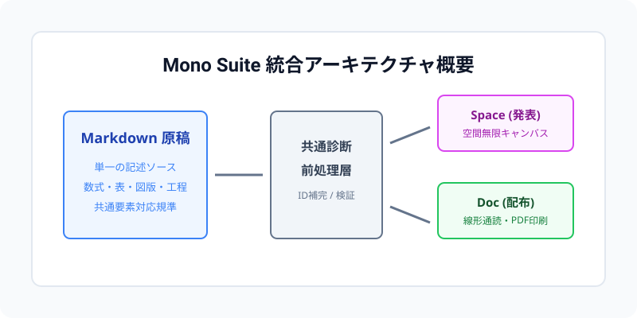

# 実践的技術ドキュメント原稿 {#practical-doc}

Mono Suiteの実務適用性を検証するための実践的な技術原稿です。
空間無限キャンバスによるプレゼンテーション（Space）と、線形通読および配布用印刷（Doc）の双方に最適化されたマルチモーダル出力を実証します。

## 概要と背景 {#overview}

現代の技術コミュニケーションにおいては、プレゼンテーション用スライドと配布・閲覧用ドキュメントの二重管理が深刻な認知負荷および保守コストを生み出しています。
発表用ツールは要点と視覚配置を重視する一方、読書用ツールは文脈と論理的な詳細記述を要求します。
Mono Suiteは、単一の記述ソースから両者の要件を満たす成果物を自動導出する制作基盤を提供します。

### 基本方針と設計原則 {#principles}

本システムは以下の基本原則に基づいて設計されています。

1. 原稿の単一性：Markdownによる構造化テキストのみを正本として維持します。
2. 出力の完全自律性：外部CDNやインターネット接続に依存せず、すべてのフォント・数式・画像を単一ファイルに封入します。
3. 形式間の責務分離：発表時は空間キャンバス、配布時は標準的な縦スクロールおよび定型印刷レイアウトを適用します。

## 技術仕様と対応要素 {#technical-spec}

多面的な技術解説に必要な主要要素の表現力を以下に示します。

### インライン装飾と参照構文 {#formatting}

Markdownの標準装飾に加えて、==強調マーカー==や==重要な留意事項=={pink}、および++補足参照++{cyan}を自在に混在させることができます。
また、`mono build` コマンドや `config.toml` のようなインラインコードも、印刷時の文字化けを起こすことなく自然に埋め込まれます。

> 技術仕様の策定においては、抽象的な概念の提示にとどまらず、具体的な実装レベルの記述と往復運動を行うことが信頼性の担保につながります。

### 比較分析表 {#comparison-table}

以下の表は、各レンダラーの特性と適用局面の比較を示しています。

| 評価軸 | Mono Space (発表用) | Mono Doc (閲覧・配布用) |
| --- | --- | --- |
| 主たる用途 | カンファレンス発表・講義・対面説明 | 報告書・配布資料・自習用テキスト |
| 閲覧体験 | 2次元無限キャンバス・ズーム遷移 | 1次元縦スクロール・見出し目次 |
| 成果物形式 | スタンドアロンHTML（JavaScript内蔵） | スタンドアロンHTMLおよび完全自己完結PDF |
| 数式描画 | 事前生成SVG（MathJax） | 事前生成SVG（MathJax） |
| アセット解決 | Base64データURI埋め込み | Base64データURI埋め込み |

### 実装コード例 {#code-example}

パイプライン呼び出しを行うPythonスクリプトの典型例です。

```python
from pathlib import Path
from mono_suite.pipeline import BuildPipeline

# 単一原稿から配布セットを一括生成
input_doc = Path("examples/practical/document.md")
output_dir = Path("dist/practical")

pipeline = BuildPipeline(
    input_path=input_doc,
    output_dir=output_dir,
    generate_pdf=True,
    offline=True,
)
published_dir = pipeline.run()
print(f"成果物配備完了: {published_dir}")
```

### 数式記述 {#math-equations}

物理法則や統計分析モデルの数式表現も、事前レンダリングされたSVGベクターとして高品質に埋め込まれます。

インライン数式の例として、ガウス分布の確率密度関数 $f(x) = \frac{1}{\sigma \sqrt{2\pi}} \exp\left( -\frac{(x-\mu)^2}{2\sigma^2} \right)$ が挙げられます。

また、以下のような複数行・複雑なディスプレイ数式も完全にレンダリングされます。

$$\oint_{\partial \Omega} \mathbf{E} \cdot d\mathbf{S} = \frac{1}{\varepsilon_0} \iiint_{\Omega} \rho \, dV$$

$$\mathcal{L}_{Total} = \mathcal{L}_{Task} + \lambda \sum_{i=1}^{K} \left( \nabla_\theta \mathcal{R}_i(\theta) \right)^2$$

## システム構造と工程フロー {#system-architecture}

Mono Suiteの内部構造と処理手順を視覚的に表現します。

### アーキテクチャ図版 {#diagram}

以下の図版は、前処理層から各レンダラーへの変換パイプラインを表したベクター図です。



## パイプライン特性の比較 {#pipeline-compare}
::layout compare
::focus subtree

### Spaceレンダラー {#space-pipeline}

入力Markdownを解析し、空間ツリー構造へ写像します。
各トピックは2次元座標へ自動配置され、シームレスなカメラ移動を実現します。

### Docレンダラー {#doc-pipeline}

入力Markdownを線形なHTML構造へと組版します。
印刷用CSSにより、ページ境界での余白調整および改ページ制御を自動実行します。

## 変換と公開のワークフロー {#workflow}
::layout flow
::focus subtree

### 原稿診断 {#diag-step}

入力ファイル、画像パス、見出しIDの完全性を検査します。

### 並行生成 {#build-step}

SpaceとDocの生成エンジンを並行稼働させ、一時領域で成果物を組み立てます。

### 成果物検証 {#verify-step}

マニフェストと全成果物の整合性を検証し、公開領域へ安全に置換します。

::connect diag-step -> build-step | 診断通過
::connect build-step -> verify-step | 生成完了
