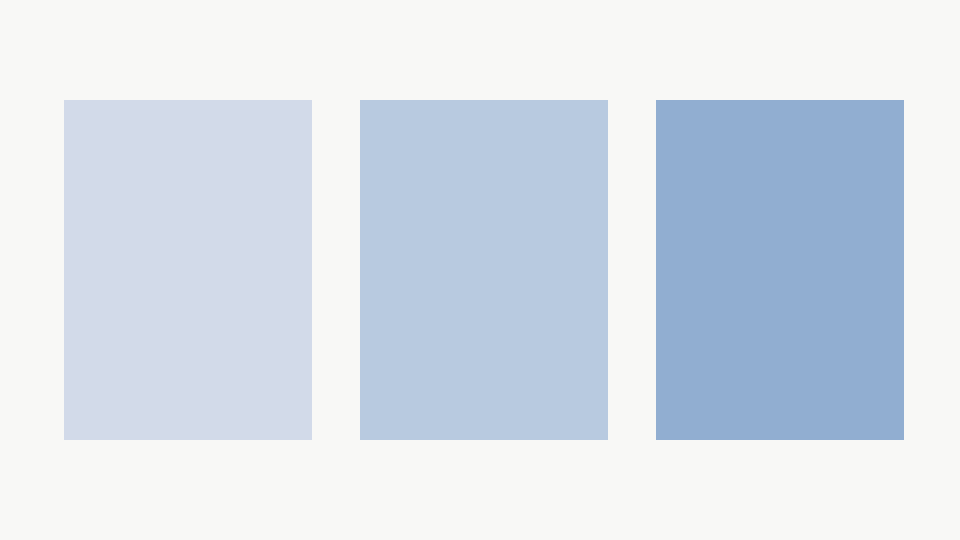

# 共通原稿の検証 {#shared}

同じ内容を発表と配布で確認するための代表原稿。

## 本文と素材 {#content}

### 日本語・表・コード {#text}

日本語の見出しと本文を保持します。

| 対象 | 確認内容 |
| --- | --- |
| 原稿 | 内容と順序 |
| 出力 | 日本語と空白 |

```python
for item in items:
    print(item)
```

> 引用の内容を残します。

### 図版 {#image}



### 数式 {#math}

周期は $T=1/f$ です。

$$E=mc^2$$

## 比較 {#comparison}
::layout compare
::focus subtree

### 発表 {#present}

話題にフォーカスします。

### 配布 {#handout}

原稿順に読みます。

## 工程 {#process}
::layout flow
::focus subtree

### 入力 {#input}

原稿と素材を固定します。

### 生成 {#build}

同じ入力版から生成します。

::connect input -> build | 同じ入力版
