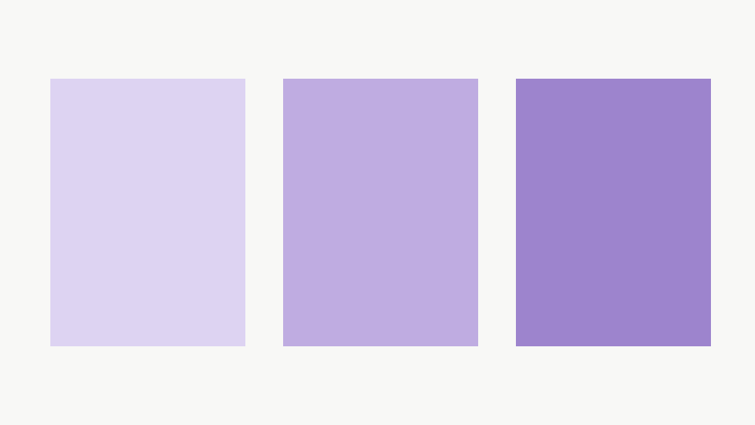

# 文書を、そのまま空間へ

通常のMarkdownだけで、教材を組み立てます。

## 文章と小見出し

### 一つの話題

本文は読みやすい幅で折り返します。
ソース上の改行は同じ段落として続きます。

#### 本文内の小見出し

見出しを深くしても、幅は狭くなりません。

- 書き手は内容と順序を決める
- 表示は共通のルールに任せる

## 写真と図版

### 2枚並べる




### 3枚並べる


## 表とコード

### 幅の役割

文章には読み幅を設け、表とコードはセクション幅を使います。

| 役割 | 幅 |
| --- | --- |
| 本文 | 最大576px |
| セクション・画像・表・コード | 768px |

```python
for item in items:
    print(item)
```

> 小さなルールを、文書全体に適用する。
